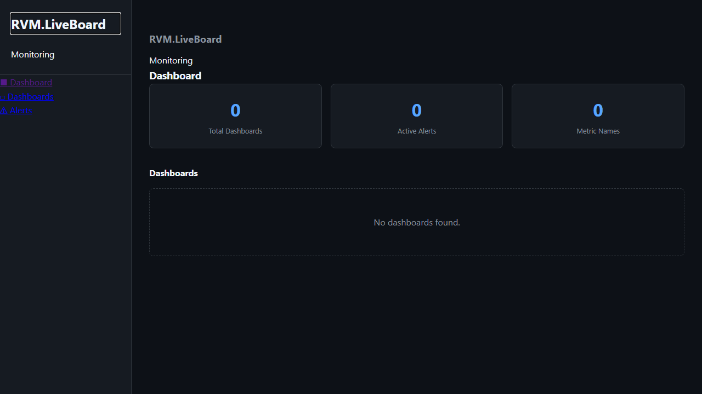
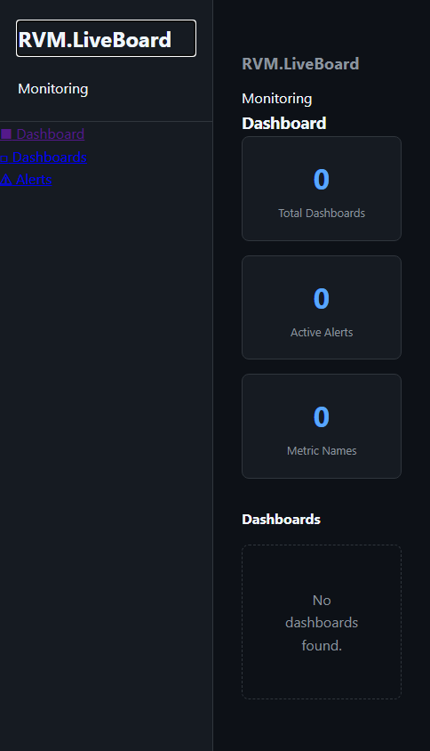
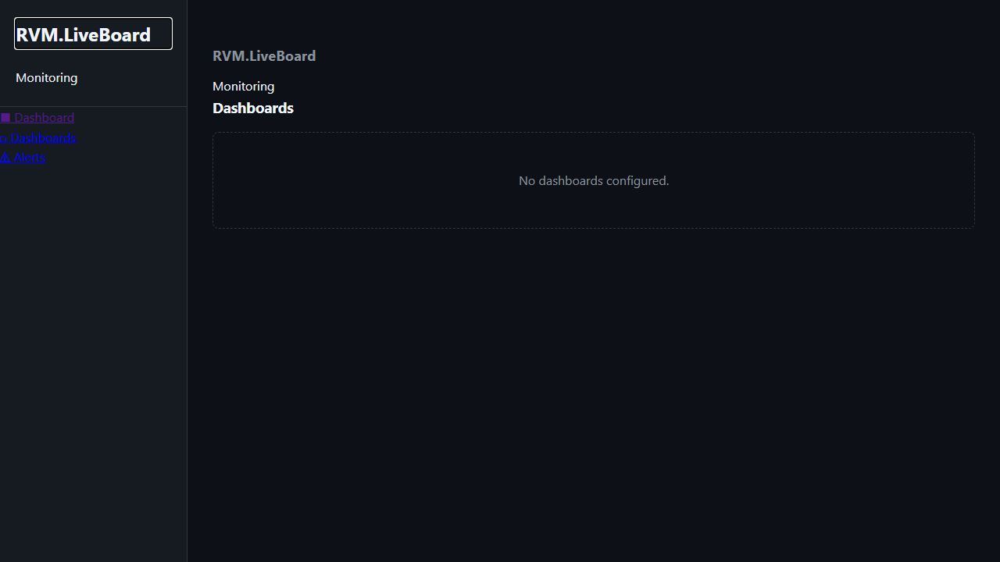
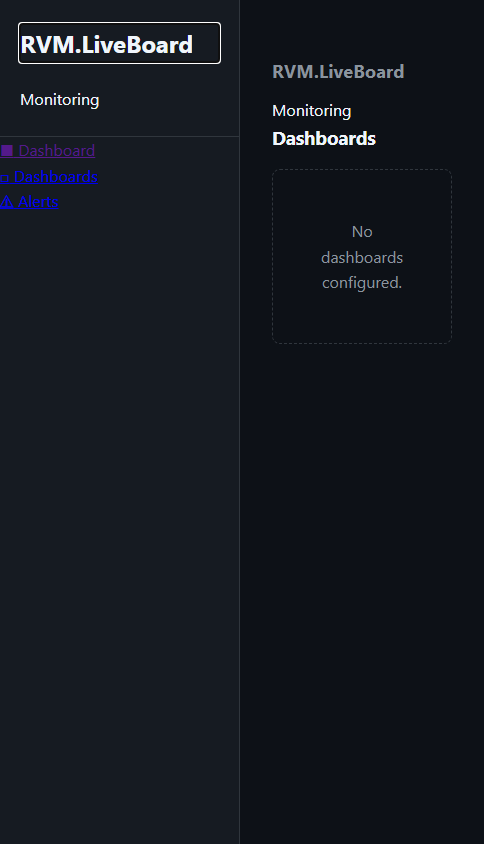

# RVM.LiveBoard - Manual do Usuario

> Dashboard Real-Time com SignalR e Redis — Guia Completo de Funcionalidades
>
> Gerado em 26/04/2026 | RVM Tech

---

## Visao Geral

O **RVM.LiveBoard** e um sistema de dashboard em tempo real com SignalR, Redis e OpenTelemetry.

**Recursos principais:**
- **Dashboard real-time** — atualizacoes via SignalR sem reload
- **Dashboards personalizados** — widgets configurados por usuario
- **Alertas por threshold** — notificacoes automaticas
- **API de ingestao** — endpoints REST para envio de metricas
- **OpenTelemetry** — traces e metricas exportados

---

## 1. Dashboard Principal

Painel de monitoramento em tempo real com metricas de negocio, infraestrutura e performance. Todos os dados sao atualizados automaticamente via SignalR sem necessidade de reload.

**Funcionalidades:**
- Widgets de metricas em tempo real (numeros, graficos, gauges)
- Atualizacao automatica via SignalR (WebSocket)
- Filtro por periodo: ultimos 5min, 15min, 1h, 6h, 24h
- Exportacao de snapshot (PNG ou PDF)
- Modo fullscreen para TVs e monitores de operacao
- Tema claro e escuro

> **Dicas:**
> - Pressione F11 para modo fullscreen — ideal para TVs de NOC e sala de operacoes.
> - Use o filtro de periodo para comparar metricas em diferentes janelas de tempo.

| Desktop | Mobile |
|---------|--------|
|  |  |

---

## 2. Dashboards Personalizados

Criacao e gerenciamento de dashboards customizados. Cada dashboard pode ter um conjunto diferente de widgets, fontes de dados e layout de grade.

**Funcionalidades:**
- Criacao de dashboards com nome e descricao
- Layout de grade configuravel (colunas e linhas)
- Adicionar widgets: linha, area, barra, gauge, numero, tabela
- Configurar fonte de dados por widget (Redis, PostgreSQL, API)
- Duplicar e excluir dashboards
- Compartilhar dashboard por URL publica

> **Dicas:**
> - Crie dashboards separados por time ou dominio (infraestrutura, negocio, produto).
> - URLs publicas permitem compartilhar o estado atual sem exigir login.

| Desktop | Mobile |
|---------|--------|
|  |  |

---

## 3. Alertas

Sistema de alertas baseado em thresholds de metricas. Alertas sao disparados quando uma metrica ultrapassa o limite configurado e resolvidos automaticamente quando volta ao normal.

**Funcionalidades:**
- Alertas ativos e historico de alertas resolvidos
- Severidades: INFO, WARNING, CRITICAL
- Configuracao de threshold por metrica
- Canais de notificacao: e-mail e webhook
- Silenciar alertas por periodo (manutencao)
- Anotacoes de contexto por alerta

> **Dicas:**
> - Use o modo "silenciar" durante janelas de manutencao para evitar falsos positivos.
> - Alertas CRITICAL devem ter canal de notificacao imediata (webhook Slack/Teams).

| Desktop | Mobile |
|---------|--------|
|  |  |

---

## 4. API de Metricas

Endpoint REST para ingestao e consulta de metricas. Servicos externos enviam metricas via POST e o dashboard as visualiza em tempo real.

**Funcionalidades:**
- POST /api/metrics — ingestao de metricas com timestamp e tags
- GET /api/metrics — consulta com filtros de nome, periodo e tags
- Suporte a tipos: counter, gauge, histogram
- Autenticacao via API Key
- Rate limiting: 1000 req/min por chave

> **Dicas:**
> - Use tags para segmentar metricas por ambiente (prod, staging) ou regiao.

| Desktop | Mobile |
|---------|--------|
|  |  |

---

## 5. Configuracoes

Configuracoes globais do LiveBoard: intervalos de retencao de dados, canais de notificacao padrao e fontes de dados externas.

**Funcionalidades:**
- Retencao de dados configuravel (7, 30, 90 dias)
- Fontes de dados: Redis, PostgreSQL, Prometheus, API customizada
- Canais de notificacao: e-mail (SMTP) e webhook
- API Keys para integracao de servicos externos
- Fuso horario do dashboard

| Desktop | Mobile |
|---------|--------|
|  |  |

---

## Informacoes Tecnicas

| Item | Detalhe |
|------|---------|
| **Tecnologia** | ASP.NET Core + Blazor Server |
| **Tempo real** | SignalR (WebSocket) |
| **Cache** | Redis |
| **Observabilidade** | OpenTelemetry (traces + metricas) |
| **Banco de dados** | PostgreSQL 16 |

---

*Documento gerado automaticamente com Playwright + TypeScript — RVM Tech*
